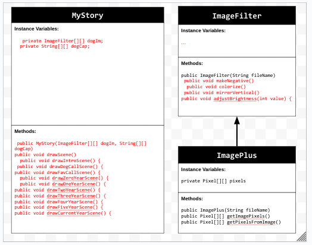

# Unit 4 - Personal Narrative

## Introduction

Images are often used to portray our personal experiences and interests. We also use image filters and effects to change or enhance the mood of an image. When combined into collages and presentations, these images tell a story about who we are and what is important to us. Your goal is to create a personal narrative using The Theater that consists of images of your personal experiences and/or interests, incorporates data related to these experiences and/or interests that can be organized in a 2D array, and uses image filters and effects to change or enhance the mood of your images.

## Requirements

Use your knowledge of object-oriented programming, two-dimensional (2D) arrays, and algorithms to create your personal narrative collage or animation:

- **Create at least two 2D arrays** – Create at least two 2D arrays to store the data that will make up your visualization.
- **Implement one or more algorithms** – Implement one or more algorithms that use loops and two-way or multi-selection statements with compound Boolean expressions to analyze the data.
- **Use Image Filters** - Include multiple image filters learned from this unit, and additionally create new ones of your own.
- **Use methods in the String class** – Use one or more methods in the String class in your program, such as to determine whether the name of an image file contains specific characters.
- **Create a visualization** – Create an image or animation that conveys the story of the data by illustrating the patterns or relationships in the data.
- **Document your code** – Use comments to explain the purpose of the methods and code segments and note any preconditions and postconditions.

## UML Diagram

Put and image of your UML Diagram here. Upload the image of your UML Diagram to your repository, then use the Markdown syntax to insert your image here. Make sure your image file name is one work, otherwise it might not properly get display on this README.

## Video

Record a short video of your story to display here on your README. You can do this by:

- Screen record your project running on Code.org.
- Upload that recording to YouTube.
- Take a thumbnail for your image.
- Upload the thumbnail image to your repo.
- Use the following markdown

## Story Description

The story my animation showcases is my dog over the years. I did this because she is a really big part of my life and I don't know what I would do without her. I also added in what I like to call her, and included the name I call her the most. The data in my project that is represented in 2D arrays is some images of my dog and the names I like to call my dog. These directly relate to the story my animation showcases because it is all about my dog and so is my project. 

## Image Filter Analysis

The image filter I created is called adjustBrightness() because it applies a brightness filter to the image. The way it does this is by first retrieving the image pixels and then looping through all of the pixels. After, it adjusts the pixel color values by getting the color values and then adding the value (which could be positive or negative). Next, clamp the values, ensuring they stay within the valid color range of 0 to 255. Finally, set the new color values. The second image filter I will explain is makeNegative() which inverts the colors in the image by setting the color values of each Pixel object to the result of 255 minus their current values. First get the array of Pixels and traverse through them. Then, select the current pixel and lastly change the color value to -255 for the current pixel.